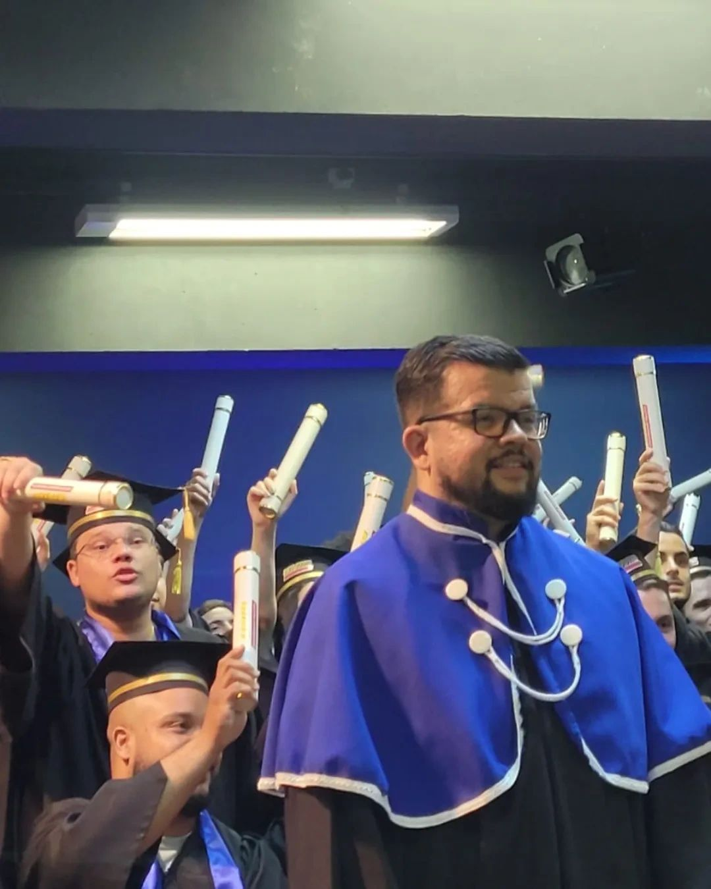

<h1>Engenharia de Software I</h1> 

### Tópicos 

:small_blue_diamond: [Ementa da Disciplina](#ementa-da-disciplina)

:small_blue_diamond: [Objetivos Gerais](#objetivos-gerais)

:small_blue_diamond: [Objetivos Específicos](#objetivos-específicos)

:small_blue_diamond: [Competências](#competências)

:small_blue_diamond: [Conteúdo Programático](#conteúdo-programático)

:small_blue_diamond: [Estratégia de Trabalho](#estratégia-de-trabalho)

:small_blue_diamond: [Avaliação](#avaliação)

:small_blue_diamond: [Bibliografia](#bibliografia)

## Emenda da Disciplina

<p align="justify">
Engenharia de Software. Fundamentação dos Princípios da Engenharia de Software. Conceituação de Produto de software. Processo de Software. Processo Pessoal de Software. Processo de Equipe de software. Modelos de Processo de Software. Modelos Ágeis. Introdução a Engenharia de Requisitos. 
</p>

## Objetivos Gerais

<p align="justify">
Proporcionar ao aluno conhecimento em métodos e técnicas de projeto que auxiliam o processo de desenvolvimento de software. Identificar, descrever e comparar os modelos de processo de desenvolvimento de software. Habilitar o aluno para escolher, utilizar e definir modelos, técnicas e ferramentas para auxiliar o processo como produto.
</p>  

## Objetivos Específicos

<p align="justify">
Aplicar as técnicas da engenharia de software a projetos de forma eficiente, adequando a técnica às necessidades do projeto específico. 
</p>  

## Competências

<p align="justify">
Compreender as técnicas de engenharia de software. Aplicar modelos de forma eficiente no desenvolvimento de software. Definir ferramentas para o desenvolvimento de software. 
</p>  

## Conteúdo Programático

<p align="justify">
:small_blue_diamond: Fundamentos da engenharia de software ;<br>
:small_blue_diamond: O processo de software;<br>
:small_blue_diamond: PSP - Processo Pessoal de Software;<br>
:small_blue_diamond: Utilização de formulários e caixas de mensagem;<br>
:small_blue_diamond: TSP - Processo de Equipe de Software;<br>
:small_blue_diamond: Modelos de processos de software (Modelos de ciclo de vida de software);<br>
:small_blue_diamond: Modelos Ágeis;<br>
:small_blue_diamond: Prática da Engenharia de Software;<br>
</p>

## Estratégia de Trabalho

<p align="justify">
As aulas são predominantemente em metodologia ativa de ensino, apoiadas nas diretrizes do plano de ensino. O desenvolvimento dos conceitos e conteúdos ocorre com apoio de bibliografia, propostas de leituras, exercícios, textos complementares, discussões no fórum/chats, sugestão de literatura e filmes, quando possível. Em conjunto com a atividade do professor da disciplina, ocorre o fórum para aprofundar discussões relevantes a cada disciplina. Com o objetivo de aprofundar o conteúdo programático e o incentivo à pesquisa, o docente pode utilizar recursos como: artigos científicos, trabalhos individuais ou em grupo e palestras, que permitam aos alunos compreenderem na prática a teoria apresentada. 
</p>  

## Avaliação

<p align="justify">
:small_blue_diamond: Provas bimestrais sobre o conteúdo exposto.<br>
:small_blue_diamond: A média do semestre será calculada de acordo com o Regimento da IES.<br>
:small_blue_diamond: As provas serão presenciais seguindo local e calendário divulgado pela instituição.<br>
</p>

## Bibliografia

<p align="justify">
PAULA  FILHO, Wilson de Pádua P. Engenharia de Software - Produtos - Vol.1. Rio de Janeiro: Grupo GEN, 2019. Disponível em: https://integrada.minhabiblioteca.com.br/. Acesso em: 29 jul. 2023. 
PRESSMAN, R. S. Engenharia de software: uma abordagem profissional. Makron Books, 1995. Disponível em: https://integrada.minhabiblioteca.com.br/. Acesso em: 29 jul. 2023.
SOMMERVILLE, I. Engenharia de software. São Paulo: Adison-Wesley,   2011. Disponível em: https://plataforma.bvirtual.com.br. Acesso em: 29 jul. 2023.
</p>  

## Como clonar o repositório na máquina :arrow_forward:

No terminal, clone o projeto: 

```
git clone https://github.com/salatielmarinho/Unip.EngenhariaSoftwareI.git
```
## Desenvolvedores/Contribuintes 

Liste o time responsável pelo desenvolvimento do projeto

<br><sub>[Prof. Salatiel Luz Marinho</sub>](https://github.com/salatielmarinho/Unip.EngenhariaSoftwareI)  

## Licença 

[Universidade Paulista - UNIP](http://www.unip.br)

Copyright :copyright: 2024 - Engenharia de Software I